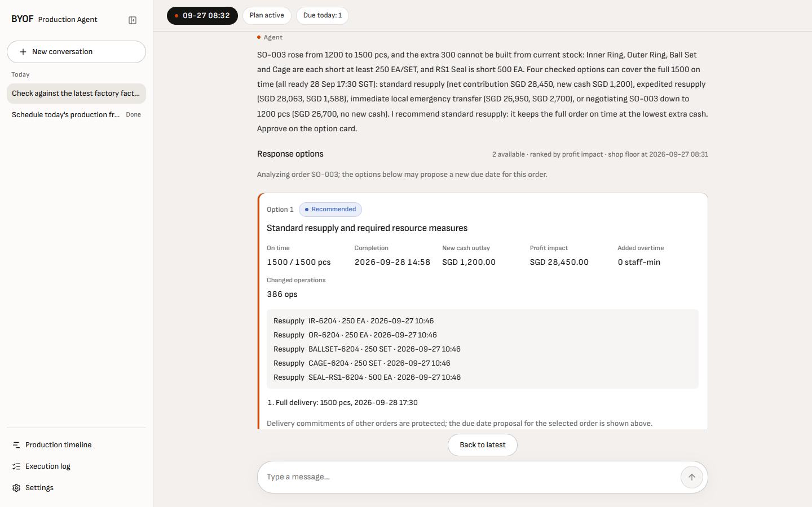
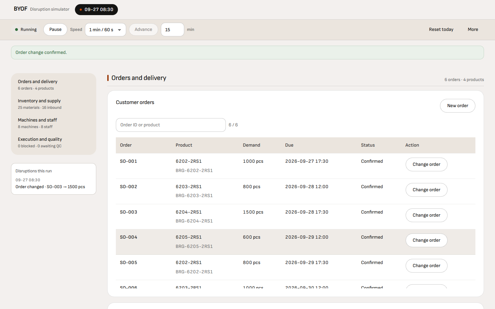

<h1 align="center">BYOF Agent</h1>

<p align="center">
  <b>Bring Your Own Factory Agent</b><br>
  Production Planning and Exception Management Agent
</p>

<p align="center">by LIZZ</p>

<p align="center">Our entry to the <b>NUS-ISS Show Me Your Agents Hackathon</b> · Problem statement: <b>Production Planning</b></p>

<table align="center">
  <tr>
    <td align="center"><a href="https://github.com/narmi924"><br><sub><b>YIMURENIJIANG</b></sub></a></td>
    <td align="center"><a href="https://github.com/liaboveall"><br><sub><b>Li Jiaxing</b></sub></a></td>
    <td align="center"><a href="https://github.com/Reality787"><br><sub><b>ZHANG LINGYUE</b></sub></a></td>
    <td align="center"><a href="https://github.com/Robinsonson"><br><sub><b>ZHU PENGXU</b></sub></a></td>
  </tr>
</table>

<p align="center">
  <a href="docs/GUIDE.md">Guide</a> ·
  <a href="docs/AGENT_ARCHITECTURE.md">Architecture</a> ·
  <a href="docs/USER_STORIES.md">User stories</a> ·
  <a href="docs/DOMAIN.md">Reference scenario</a> ·
  <a href="docs/BYOF_Technical_Document.pdf">Technical document (PDF)</a>
</p>



## What it is

Orders change, material arrives late, machines stop and people are absent. In a small or mid-sized factory these changes are usually handled with spreadsheets and experience, one phone call at a time.

BYOF Agent gives the production manager an assistant for that work. The Agent checks the factory facts, works out what a change means for every order, and compares concrete responses — resupply, expedited repair, qualified cover, overtime, a negotiated due date or a smaller quantity — with their cash, profit and delivery impact. The manager approves one option; the Agent then carries it out, reschedules production and follows the factory's confirmation.

- **Facts before answers.** Orders, stock, receipts, machines, staff and work in progress come from the factory system; the model never invents them.
- **Schedules that hold.** Every plan is solved with OR-Tools CP-SAT and verified by an independent Checker before it can be approved.
- **Costs you can compare.** Options are priced from a versioned catalog, with new cash outlay, profit impact, on-time delivery and added overtime side by side.
- **The manager decides.** Only an approval on an option card starts execution; chat never counts as approval, and the model cannot approve on its own.

## How it works

Two people work side by side, each in a browser window:

1. **The disruption simulator** plays the shop floor: it changes orders, delays receipts, stops machines or marks people absent.
2. **The manager** opens the change in a conversation. The Agent verifies the facts and compares response options within a time limit.
3. The manager reads the recommendation, asks follow-up questions and approves one option.
4. The Agent applies the measures through restricted business commands, checks the new schedule within the approved scope, releases it to the factory and reports back.


More in [Agent architecture](docs/AGENT_ARCHITECTURE.md).



## Quick start

Requires Docker with Compose v2 and [uv](https://docs.astral.sh/uv/).

```sh
git clone https://github.com/narmi924/byof-agent.git
cd byof-agent
uv sync --locked
uv run --locked python -m scripts.compose_config
```

Put a DeepSeek API key in `LLM_GATEWAY_API_KEY` in the generated `.runtime/compose.env`, then:

```sh
docker compose --env-file .runtime/compose.env build api web
docker compose --env-file .runtime/compose.env up --detach --wait --wait-timeout 300
docker compose --env-file .runtime/compose.env run --rm team-setup
```

Open the manager at <http://127.0.0.1:18080/agent/chat> and the simulator at <http://127.0.0.1:18080/factory/facts>, click **Reset today** in the simulator, then **Plan today** as the manager. The [guide](docs/GUIDE.md) walks through a full working day, the disruptions to try and the development setup.

## Built with

Python, FastAPI, LangGraph, OR-Tools CP-SAT, SQLAlchemy and PostgreSQL on the backend; React, TypeScript and Vite on the frontend; Docker Compose to run it all. The Agent works with DeepSeek, or with Claude through a compatible gateway.

## License

[MIT](LICENSE)
