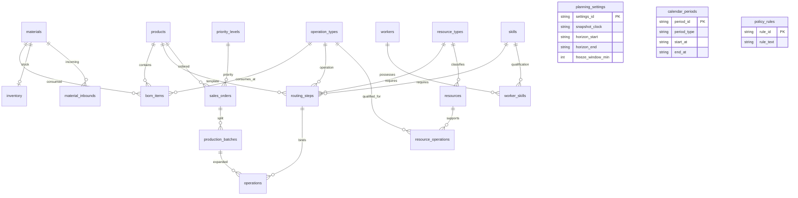

# Table relations

Every line in the diagram is a SQL foreign key; `planning_settings`, `calendar_periods` and `policy_rules` are independent configuration tables of the single factory. There is no invented key from the calendar to workers: at the start all workers and resources share the regular shifts, and individual overtime eligibility is recorded on `workers`.

Composite keys: `production_batches(order_id, product_id)` references `sales_orders`, so a batch cannot belong to the wrong product; `operations(batch_id, product_id, routing_version)` references `production_batches`, and `(routing_step_id, product_id, routing_version, op_code, sequence_no)` references `routing_steps`, so an operation always uses a routing step of the same product and version.

`bom_items`, `worker_skills` and `resource_operations` are relation tables with composite primary keys. Fields are described in [data_dictionary.md](data_dictionary.md); `schema.sql` holds the complete constraints.

Routing completeness, order and batch quantity conservation, the operation time formula and resource/skill matching are cross-row rules checked by `validate_data.py`. Calendar, freeze, work-in-progress and stock timing rules are enforced by the scheduler, the independent Checker and the application's transactions.
