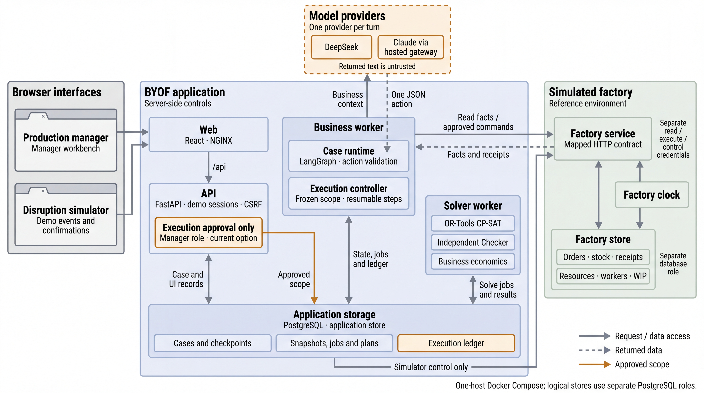

# Agent architecture

The model investigates, calls restricted tools and explains; deterministic services own the facts, costs, scheduling, checking and execution. After the manager approves a concrete option, the Agent changes the factory through business commands; it never gets arbitrary SQL or the right to approve on its own.

The business worker sends business context to one selected model provider per turn and treats the returned JSON action as untrusted input. The orange path is execution approval only; investigation and fact reads do not wait for it. The factory is reached only through its mapped HTTP contract with separate read, execute and control credentials.

| Layer | Responsibility and boundary |
|---|---|
| Source | Orders, stock, receipts, resources, execution and quality records are the facts; the factory clock is independent of the chat window. The disruption simulator only creates and records facts. |
| Agent | LangGraph checkpoints and PostgreSQL keep inputs, tool activity and human decisions. Actions follow a strict JSON contract that does not depend on vendor-native function calling. |
| Model | The backend registers DeepSeek and Claude (through a hosted gateway); the browser only chooses a model ID, and keys stay in the server environment. Each turn has a fixed provider with no silent fallback. |
| Options | Standard, expedited and immediate supply, repair, qualified cover, due date and quantity changes are combined in isolated snapshots; supply has order multiples, limits, lead times and costs. When no measure keeps a due date, the options propose a new date for the customer to agree to. |
| Economics | A fixed catalog computes net contribution, new cash, surcharges and tardiness losses in SGD, counting regular material cost once. The adverse case states its surcharge and delay assumptions and is not a probability or a new solve. |
| Recommendation | Hard constraints and the cash limit come first, then clearly dominated options are filtered out; an explicit request in the conversation beats saved preferences, and net contribution is the default goal. There is no claim of a global economic optimum. |
| Scheduling | CP-SAT handles material, routes, skills, machines, shifts, work in progress and freeze windows; the Checker verifies every schedule independently. The search hint covers every operation, polishing stops when a feasible solution stops improving, and option comparisons run in parallel across CPUs. "Plan today" without disruptions uses a preset plan that the Checker verifies in the same way. |
| Approval | The manager approves an immutable scope of actions, cost and impact, confirming overtime and customer agreement in the same place when needed; model text never counts as approval. |
| Execution | Persistent stages are prepare, apply measures, solve, release, done or needs attention. Factory commands are idempotent, and a lost receipt is checked against the original request. Cancelling keeps facts already applied and only blocks the remaining steps. |
| Follow-up | Standard supply is received on the factory clock and immediate supply at once; the plan and receipts link back to the original conversation, and production keeps being followed. Unknown remaining work still needs a confirmed fact from the shop floor. |

Each analysis turn has at most 8 model requests and each conversation at most 40. The same facts and parameters are not calculated twice, and equivalent solves across conversations share one background job. A new manager question can change the search conditions, but an automatic wake-up cannot refresh the budget. Response options share a search budget of at most 120 seconds and usually finish in 20–40 seconds. Stopping an analysis forbids automatic continuation and does not undo approved business actions.

Before execution, short clock advances without business fact changes are allowed; a material change in the facts or exceeding the approved scope stops execution while keeping completed operations. A new schedule must pass the Checker; verbal assurances never replace feasibility.

## Implementation entries

- [Case runtime](../packages/agent/case_runtime.py), [action contract](../packages/agent/decisions.py), [execution ledger](../packages/agent/treatment_execution.py)
- [Treatment actions](../packages/domain/treatment.py), [economics catalog](../packages/domain/economics.py), [option comparison](../packages/planning/business_options.py)
- [Solver](../packages/planning/solver.py), [Checker](../packages/planning/checker.py), [reliable release](../packages/planning/publication.py)
- [Model menu](../packages/providers/catalog.py), [workbench](../apps/web/src/Workbench.tsx)

There is no arbitrary SQL, shell or network access, no self-approval by the model, no real purchasing and no automatic customer contracting. Email notifications are disabled.
